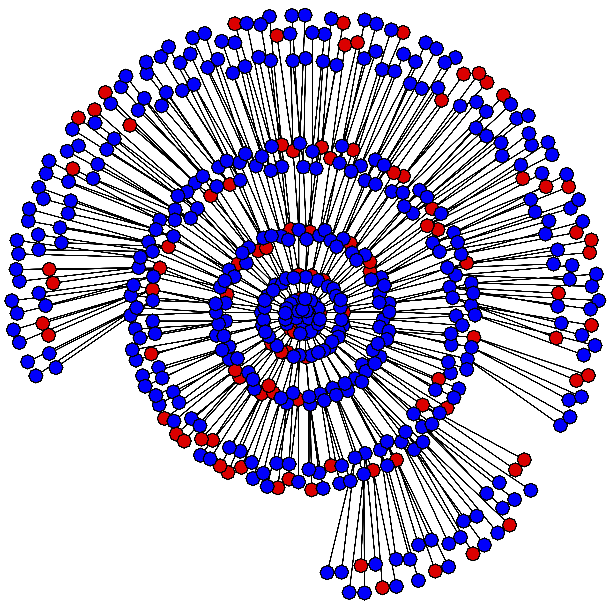

The Hard-to-Reach Population Methods Research Group (HPMRG) focuses on developing statistical methodology to help improve understanding of hard-to-reach or otherwise "hidden" populations. 

These populations are characterized by the difficulty in survey sampling from them using standard probability methods. Typically, a sampling frame for the target population is not available, and its members are rare or stigmatized in the larger population so that it is prohibitively expensive to contact them through the available frames. Examples of such populations in a behavioral and social setting include injection drug users, men who have sex with men, and female sex workers. Examples in an economic setting include unregulated workers and the self-employed. Hard-to-reach populations in the US and elsewhere are under-served by current sampling methodologies mainly due to the lack of practical alternatives to address these methodological difficulties.

The Hard-to-Reach Population Methods Research Group is an collaborative interdisciplinary group of researchers from several universities:

**Dr. Krista J. Gile** is Associate Professor of Statistics in the Department of Mathematics and Statistics at the University of Massachusetts - Amherst.  Her research focuses on developing statistical methodology for social and behavioral science research, particularly related to making inference from partially-observed social network structures. Most of her current work is focused on understanding the strengths and limitations of data sampled with link-tracing designs such as snowball sampling, contact tracing, and respondent-driven sampling.  In particular, her dissertation and recent work focus on understanding the implications of assumptions of current respondent-driven sampling (RDS) methodology, and on introducing improved estimation strategies for RDS data. For details see [her web page](http://www.math.umass.edu/~gile/).

***Dr. Mark S. Handcock*** is Professor of Statistics in the Department of Statistics at the University of California – Los Angeles. His research involves methodological development, and is based largely on motivation from questions in the social and epidemiological sciences. He has published extensively on survey sampling, network inference, and network sampling methods. For details see [his web page](https://handcock.gthub.io).

***Dr. Lisa G. Johnston*** is an Epidemiologist-Independent Consultant providing technical assistance for over 15 years to international organizations, Universities, and institutions worldwide to conduct surveys and population size estimation techniques among hard-to-reach populations. Most of her work has focused on conducting HIV bio-behavioral surveillance surveys and size estimations using RDS among men who have sex with men, sex workers and people who inject drugs, high risk adolescents and youth and migrants. She has conducted and analyzed data from over 400 RDS surveys in over 40 countries and has published over 45 peer reviewed journal articles about RDS. She has authored several book chapters and developed manuals and guidance on implementing surveys and analyzing data using RDS. For details see [her web page](http://www.lisagjohnston.com/).

***Dr. Cori M. Mar*** is the former Director of the Statistics Core at the Center for Studies in Demography and Ecology (CSDE) at the University of Washington.  Her duties included providing training in statistical methods, data analysis techniques, and statistical programming. Dr. Mar has taught R in a variety of formats from a 2-3 hour one class introduction to one hour a week through a 10 week course. Dr. Mar has extensive experience as a translator between statisticians and the applied researchers. For details see [the web page](http://csde.washington.edu/services/statistics.shtml).

***Dr. Ian E. Fellows***  is a professional statistician based out of the University of California, Los Angeles. His research interests range over many sub-disciplines of statistics, with his dissertation work focusing on new methods in the analysis of social network sampling designs (such as RDS). He has designed statistical user interfaces for both academic and corporate clients, and in 2011 one of his designs won the prestigious John Chambers Award. He is the primary author of RDS Analyst’s graphical user interface.
or details see [his web page](http://fellstat.com).

***Katherine R. McLaughlin***  is Assistant Professor of Statistics in the Department of Statistics at the Oregon State University. She works in many areas of statistics, often with application to social demography and global health.  She is an expert in social network analysis, network sampling, survey sampling and social statistics. Her dissertation work focuses on modeling preferential recruitment for RDS and Peer-Driven Interventions. For details see [her web page](http://www.science.oregonstate.edu/~mclaugka/).
